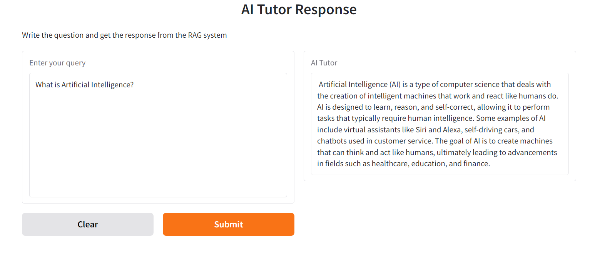

## Overview

This repository contains the code of the final "Part 4; Building Your Own advanced LLM + RAG Project to receive certification" lesson of the "From Beginner to Advanced LLM Developer" course.

## Notes
- AI_Tutor_FT.ipynb is only to fine tune the model and save in Hugging Face space. This will not be required to exeute to launch the app. 
- AI_Tutor_RAG.ipynb is for RAG implementation. This is modularized and moved to app.py.
- This project used below:
    - finetuned LLM in the app. 
    - Data collection and curation process leverages structured JSON
    - metadata filtering
    - RAG evaluation
    - Prompt cahcing
- For RAG evaluation, Hit Rate: 0.50, Mean Reciprocal Rank (MRR): 0.50. Used simple eval set.
- During execution, app will ask to enter HuggingFace access token. So, be ready with that.

## Setup

1. Create a local virtual environment, for example using the `venv` module. Then, activate it.

```bash
python -m venv venv
source venv/bin/activate
```

3. Install the dependencies. (Microsoft Visual C++ 14.0 or greater is required. Get it with "Microsoft C++ Build Tools": https://visualstudio.microsoft.com/visual-cpp-build-tools/. Otherwise langchain_chroma installtion will fail.)

```bash
pip install -r requirements.txt
```

4. Launch the Gradio app.

```bash
python app.py
```

